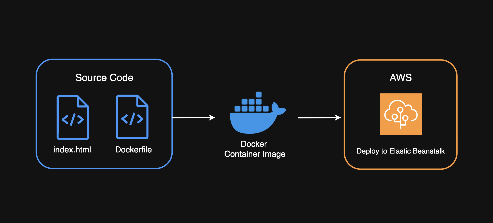

# Docker Web App Deployment with AWS Elastic Beanstalk



## Project Overview

This project demonstrates containerization of a web application using Docker and deployment to AWS Elastic Beanstalk. Built a custom Nginx-based container image and deployed it to the cloud with minimal configuration.


## Architecture

The deployment workflow:
1. Source code (index.html + Dockerfile)
2. Docker builds container image
3. Container runs locally for testing
4. Deploy to AWS Elastic Beanstalk (~7 minutes)

## Key Concepts

**Containers:** Lightweight, portable environments that package an application with all dependencies, libraries, and runtime requirements.

**Container Image:** A packaged blueprint containing code, dependencies, libraries, and configuration needed to create a running container.

**Docker Daemon:** Background service that builds images, runs containers, manages networks, and handles low-level operations.

**Nginx:** Web server used to serve websites and web applications.


## Implementation Steps

### 1. Run Basic Nginx Container
```bash
# Start Nginx container (detached mode, port 80)
docker run -d -p 80:80 nginx
```

### 2. Create Custom Dockerfile

Create a `Dockerfile` with these instructions:
1. Start with official Nginx image as base
2. Replace default webpage with custom HTML
3. Expose port 80 for web traffic
```dockerfile
FROM nginx:latest
COPY app/index.html /usr/share/nginx/html/
EXPOSE 80
```

### 3. Build Custom Image
```bash
# Build image from Dockerfile in current directory
docker build -t my-custom-image .
```

### 4. Run Custom Container
```bash
# Stop previous container if running
docker stop <container-id>
docker rm <container-id>

# Run new custom container
docker run -d -p 80:80 my-custom-image
```

### 5. Deploy to Elastic Beanstalk

AWS Elastic Beanstalk simplifies running Docker containers in the cloud without complex setup.

1. Create Elastic Beanstalk application
2. Upload Docker configuration
3. Deploy container (~7 minutes)

## Troubleshooting

**Port 80 already in use error:**
- Stop and remove existing container using same port
- Verify with `docker ps` before running new container

## Project Structure
```
docker-app-elastic-beanstalk/
├── README.md
├── Dockerfile
├── Dockerrun.aws.json
├── docker-commands.sh
├── docs/
│   └── legendary-aws-compute-eb.pdf
├── diagrams/
│   └── architecture-diagram.png
└── app/
    └── index.html
```

## Key Learning Points

1. Docker instructions translate directly into container behavior
2. Container images are blueprints; containers are running instances
3. Port conflicts require stopping previous containers
4. Elastic Beanstalk simplifies cloud deployment
5. Zip files stored in S3 during Elastic Beanstalk deployment

## Useful Docker Commands
```bash
# List running containers
docker ps

# List all containers (including stopped)
docker ps -a

# View container logs
docker logs <container-id>

# Execute commands in running container
docker exec -it <container-id> /bin/bash

# Stop container
docker stop <container-id>

# Remove container
docker rm <container-id>

# List images
docker images

# Remove image
docker rmi <image-id>
```


## Author

**Diego Losada**  
NextWork Student | Cloud Engineering
